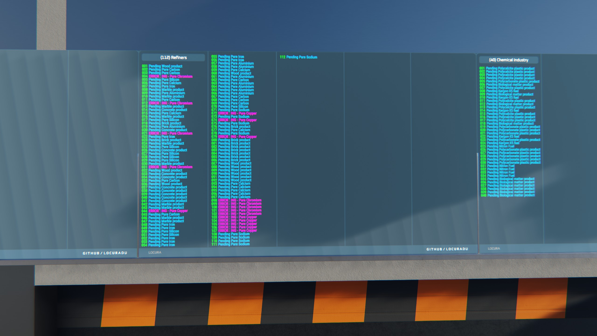
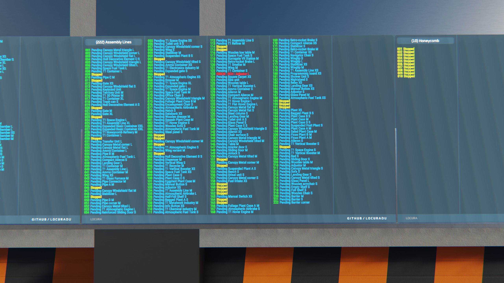
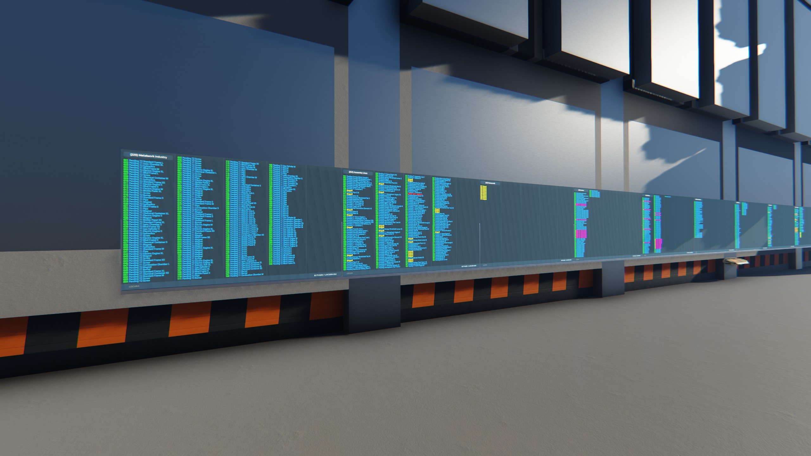

:heavy_exclamation_mark: | Development taken over with permissions.
:---: | :---

# Information
 A single board script for diplaying all your factory information. This script is helpful for those that dont like using HUDs and can be used on 1 to 9 screens depending on factory size. 

---

# Preview

# Installation / Documentation / Wiki

# Screen And Sign Compatibility

# Ways To Help
- Contribute new code, or updating whats already here
- Donate for Dr Pepper funds at Venmo @terranbytes
- Join or start a discussion on the discussions tab

# Contacts
- Credence (Dual Universe)
- credence.locura (Discord)
- CredenceHamby (GitHub)

# Other
> **Note**
> - This was originally a fork from (https://github.com/BartasRS).
> - Original code was by (https://github.com/BartasRS) and (https://github.com/CredenceHamby).

> **Warning**
> This may or may not work with some screens or signs. Please check list above for compatibility.

> **Warning**
> Too many screen in an area will hurt game performance. The game will also start throttling back screen quality upon reaching a certain number of screens. Using Animations in screens will make this much worse. Only use a few animated screens in an area for best performance.
